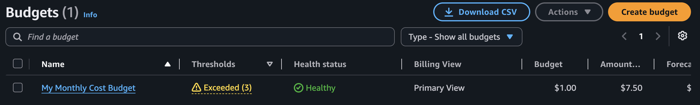
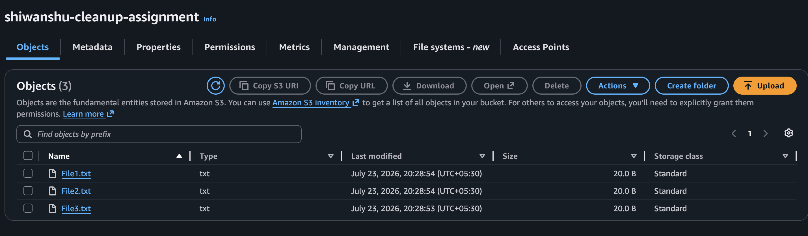
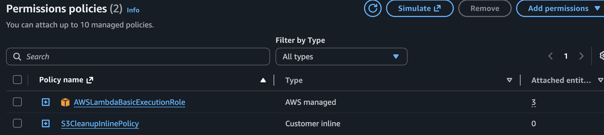
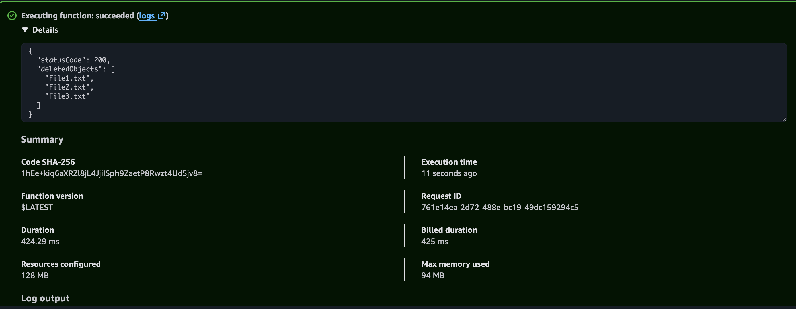
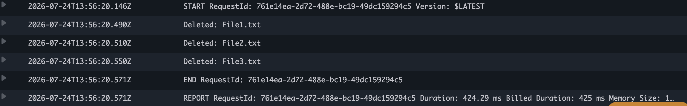

# Task 1 – Automated S3 Bucket Cleanup (Objects Older Than 30 Days)

## Objective

The objective of this task is to automate the deletion of stale objects from an Amazon S3 bucket using **AWS Lambda** and **Boto3**. The Lambda function scans the specified S3 bucket, identifies objects older than the configured retention period, deletes them, and records the deleted object names in Amazon CloudWatch Logs.

---

# AWS Services Used

* Amazon S3
* AWS Lambda
* AWS IAM
* Amazon CloudWatch Logs
* AWS Budgets
* Python 3.12
* Boto3

---

# AWS Region

| Property    | Value                 |
| ----------- | --------------------- |
| Region      | Asia Pacific (Mumbai) |
| Region Code | ap-south-1            |

---

# Bucket Information

| Property        | Value                          |
| --------------- | ------------------------------ |
| Bucket Name     | `shiwanshu-cleanup-assignment` |
| Runtime         | Python 3.12                    |
| IAM Role        | `LambdaS3CleanupRole`          |
| Lambda Function | `S3BucketCleanup`              |

---

# Project Structure

```text
Task1/
│
├── README.md
├── S3BucketCleanupLambdaFunction.py
├── S3BucketCleanupIAM-Policy.json
├── Demo_Files/
│   ├── File1.txt
│   ├── File2.txt
│   └── File3.txt
└── Image/
    ├── Budget-Creating.png
    ├── IAM-Role.png
    ├── S3-Files.png
    ├── S3-CleanUp-Test.png
    ├── Cloudwatch-Log.png
    └── EBSSnapshotTest.png
```

---

# Implementation Steps

## Step 1 – Create AWS Budget

Created an AWS Budget Alert to monitor AWS account spending during the assignment and avoid unexpected AWS charges.

### Screenshot



---

## Step 2 – Create Amazon S3 Bucket

Created an Amazon S3 bucket named:

```text
shiwanshu-cleanup-assignment
```

The bucket was created in the **Asia Pacific (Mumbai)** Region.

---

## Step 3 – Upload Sample Files

Uploaded sample files into the S3 bucket for testing the cleanup process.

Uploaded files:

```text
File1.txt
File2.txt
File3.txt
```

These files were used to verify that the Lambda function deletes only the objects older than the configured retention period.

### Screenshot



---

## Step 4 – Create IAM Role

Created a new IAM Role named:

```text
LambdaS3CleanupRole
```

Selected **AWS Lambda** as the trusted service.

---

## Step 5 – Attach Managed Policy

Attached the AWS managed policy:

```text
AWSLambdaBasicExecutionRole
```

This policy allows the Lambda function to create log groups, log streams, and write execution logs to Amazon CloudWatch.

---

## Step 6 – Create Inline IAM Policy

Created an inline IAM policy following the principle of least privilege.

Permissions included:

* `s3:ListBucket`
* `s3:DeleteObject`

The permissions were scoped only to the target S3 bucket.

Policy file included in this repository:

```text
Task1/S3BucketCleanupIAM-Policy.json
```

### Screenshot



---

## Step 7 – Create Lambda Function

Created an AWS Lambda Function using the following configuration.

| Setting        | Value               |
| -------------- | ------------------- |
| Function Name  | S3BucketCleanup     |
| Runtime        | Python 3.12         |
| Architecture   | x86_64              |
| Execution Role | LambdaS3CleanupRole |

---

## Step 8 – Upload Lambda Function Code

Uploaded the Python Boto3 script to the Lambda function.

The source code is available in:

```text
Task1/S3BucketCleanupLambdaFunction.py
```

The Lambda function performs the following operations:

* Connects to Amazon S3 using Boto3.
* Uses an S3 paginator to retrieve all objects.
* Retrieves each object's **LastModified** timestamp.
* Compares the timestamp with the current UTC time.
* Deletes objects older than the configured threshold.
* Prints the deleted object names to CloudWatch Logs.

---

## Step 9 – Configure the Retention Period

Since Amazon S3 does not allow manually creating objects with an older timestamp, the retention period was temporarily changed to **5 minutes** for testing.

```python
AGE_THRESHOLD = timedelta(minutes=5)
```

After successful testing, the code was updated back to the production requirement.

```python
AGE_THRESHOLD = timedelta(days=30)
```

---

## Step 10 – Deploy the Lambda Function

Clicked **Deploy** to upload the latest Lambda function code and configuration.

Deployment completed successfully.

---

## Step 11 – Test the Lambda Function

Manually invoked the Lambda function using the **Test** button in the AWS Lambda Console.

Verified that the function successfully identified and deleted objects older than the configured threshold.

### Screenshot



---

## Step 12 – Verify S3 Bucket

Verified that only the objects newer than the configured threshold remained inside the bucket after the Lambda function completed successfully.

---

## Step 13 – Verify CloudWatch Logs

Opened Amazon CloudWatch Logs to verify the Lambda execution.

The logs confirmed successful execution and displayed the deleted object names.

Example output:

```text
Deleted: File1.txt
Deleted: File2.txt
Deleted: File3.txt
```

### Screenshot



---

# Lambda Function

The complete Lambda source code is available here:

```text
Task1/S3BucketCleanupLambdaFunction.py
```

---

# IAM Policy

The IAM inline policy used for this task is available here:

```text
Task1/S3BucketCleanupIAM-Policy.json
```

---

# Testing

* Created an S3 bucket.
* Uploaded sample files.
* Temporarily changed the retention period from **30 days** to **5 minutes**.
* Invoked the Lambda function manually.
* Verified that old files were deleted successfully.
* Verified successful execution through Amazon CloudWatch Logs.
* Restored the retention period back to **30 days**.

---

# Screenshots

## 1. Budget Creation

Created an AWS Budget Alert to monitor account spending.


---

## 2. IAM Role

Created the **LambdaS3CleanupRole** with the required least-privilege permissions.


---

## 3. S3 Bucket Files

Uploaded sample files into the S3 bucket before testing.


---

## 4. Lambda Test Invocation

Successfully invoked the Lambda function and verified object deletion.


---

## 5. CloudWatch Logs

Verified successful execution and deletion logs in Amazon CloudWatch.


# Production Consideration

Amazon **S3 Lifecycle Rules** are the recommended managed solution for automatically deleting objects based on age because they require no code and incur minimal operational overhead.

AWS Lambda is a better choice when custom business logic is required, such as deleting files based on naming conventions, metadata, conditional rules, or triggering additional actions in other AWS services after object deletion.

---

# Assignment Requirements Covered

* ✅ Python 3.12 Runtime
* ✅ AWS Lambda
* ✅ Amazon S3
* ✅ IAM Least-Privilege Inline Policy
* ✅ Boto3 Implementation
* ✅ S3 Paginator
* ✅ Timezone-aware Date Comparison
* ✅ Delete Objects Older Than 30 Days
* ✅ CloudWatch Logging
* ✅ Manual Testing
* ✅ Documentation
* ✅ Screenshots

---

# Result

Successfully automated the cleanup of Amazon S3 objects using AWS Lambda and Boto3. The Lambda function correctly identified objects older than the configured retention period, deleted them from the specified bucket, and recorded the execution details in Amazon CloudWatch Logs. The implementation satisfied all assignment requirements and demonstrated automated S3 object lifecycle management using serverless AWS services.
