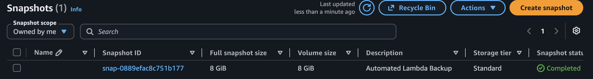
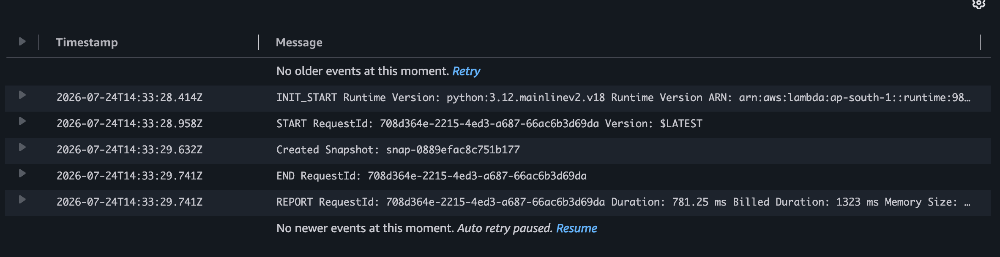

# Task 2 – Automated EBS Snapshot Creation and Cleanup

## Objective

The objective of this task is to automate the creation and cleanup of Amazon EBS snapshots using **AWS Lambda** and **Boto3**. The Lambda function creates a snapshot of a specified EBS volume, tags it for identification, removes snapshots older than the configured retention period, and records all activities in Amazon CloudWatch Logs.

---

# AWS Services Used

- Amazon EC2
- Amazon EBS
- AWS Lambda
- AWS IAM
- Amazon EventBridge
- Amazon CloudWatch Logs
- Python 3.12
- Boto3

---

# AWS Region

| Property | Value |
|----------|-------|
| Region | Asia Pacific (Mumbai) |
| Region Code | ap-south-1 |

---

# Resource Information

| Resource | Value |
|----------|-------|
| EC2 Instance | EBS-Backup-Server |
| EBS Volume ID | vol-0035f7b3edf669a4f |
| Lambda Function | EBSSnapshotAutomation |
| IAM Role | LambdaEBSBackupRole |
| Runtime | Python 3.12 |

---

# Project Structure

```text
Task2/
│
├── README.md
├── EBSSnapshotAutomationLambdaFunction.py
├── EBSSnapshotAutomationIAM-Policy.json
└── Image/
    ├── Task2-Screenshot-Captured-Completed.png
    └── Task2-Cloudwatch-Log.png
```

---

# Implementation Steps

## Step 1 – Create EC2 Instance

Created an Amazon EC2 instance named:

```text
EBS-Backup-Server
```

The instance contains the Amazon EBS volume used for automated snapshot creation.

---

## Step 2 – Identify the EBS Volume

Opened the EC2 console and identified the root EBS volume attached to the instance.

Volume ID:

```text
vol-0035f7b3edf669a4f
```

This volume is used as the source volume for snapshot automation.

---

## Step 3 – Create IAM Role

Created an IAM role named:

```text
LambdaEBSBackupRole
```

Selected **AWS Lambda** as the trusted service.

---

## Step 4 – Attach Managed Policy

Attached the AWS managed policy:

```text
AWSLambdaBasicExecutionRole
```

This policy enables the Lambda function to write execution logs to Amazon CloudWatch Logs.

---

## Step 5 – Create Inline IAM Policy

Created an inline IAM policy following the principle of least privilege.

The policy grants the following permissions:

- ec2:CreateSnapshot
- ec2:DescribeSnapshots
- ec2:DeleteSnapshot
- ec2:CreateTags

These permissions are restricted to only the required EC2 snapshot operations.

The policy file is available in this repository:

```text
Task2/EBSSnapshotAutomationIAM-Policy.json
```

---

## Step 6 – Create Lambda Function

Created an AWS Lambda function with the following configuration.

| Setting | Value |
|---------|-------|
| Function Name | EBSSnapshotAutomation |
| Runtime | Python 3.12 |
| Architecture | x86_64 |
| Execution Role | LambdaEBSBackupRole |

---

## Step 7 – Upload Lambda Function Code

Uploaded the Python Boto3 script to the Lambda function.

The source code is available in:

```text
Task2/EBSSnapshotAutomationLambdaFunction.py
```

The Lambda function performs the following operations:

- Creates a snapshot of the specified EBS volume.
- Applies the tag:

```text
CreatedBy = Lambda-Backup
```

- Lists all snapshots created by Lambda.
- Deletes snapshots older than the configured retention period.
- Prints the Snapshot IDs of newly created and deleted snapshots.
- Stores execution logs in Amazon CloudWatch Logs.

---

## Step 8 – Configure the EBS Volume ID

Updated the Lambda function by specifying the EBS Volume ID that needs to be backed up automatically.

```python
VOLUME_ID = "vol-0035f7b3edf669a4f"
```

This ensures the Lambda function creates snapshots only for the specified EBS volume.

---

## Step 9 – Configure Snapshot Retention Period

For testing purposes, the snapshot retention period was temporarily configured to **5 minutes**.

```python
RETENTION_PERIOD = timedelta(minutes=5)
```

After successful testing, the code was updated to the required production value.

```python
RETENTION_PERIOD = timedelta(days=30)
```

This allows snapshots older than 30 days to be automatically deleted.

---

## Step 10 – Deploy the Lambda Function

After updating the source code, the Lambda function was deployed successfully.

The deployment completed without any errors, making the function ready for testing.

---

## Step 11 – Configure EventBridge Scheduler

Created an Amazon EventBridge Scheduler to automatically invoke the Lambda function every week.

Configuration:

| Setting | Value |
|---------|-------|
| Schedule Type | Recurring |
| Frequency | Weekly |
| Target | EBSSnapshotAutomation Lambda Function |

This eliminates the need for manual execution and automates the backup process.

---

## Step 12 – Test the Lambda Function

Manually invoked the Lambda function from the AWS Lambda Console.

The function performed the following operations successfully:

- Created a new snapshot of the EBS volume.
- Tagged the snapshot with:

```text
CreatedBy = Lambda-Backup
```

- Retrieved previously created snapshots.
- Checked the snapshot retention period.
- Deleted snapshots older than the configured retention period.
- Printed snapshot information in CloudWatch Logs.

---

## Step 13 – Verify Snapshot Creation

Opened the Amazon EC2 Console and navigated to:

```text
Elastic Block Store
        ↓
Snapshots
```

Verified that a new snapshot had been created successfully for the specified EBS volume.

The snapshot contained the required tag:

```text
CreatedBy = Lambda-Backup
```

This confirms that the Lambda function successfully created and tagged the snapshot.

### Screenshot



---

## Step 14 – Verify CloudWatch Logs

Opened Amazon CloudWatch Logs and verified the successful execution of the Lambda function.

The logs confirmed:

- Snapshot creation
- Snapshot tagging
- Cleanup operation
- Successful Lambda execution

Example Log Output:

```text
Created Snapshot:
snap-0889efac8c751b177
```

### Screenshot



---

# Lambda Function

The Lambda function performs the following operations automatically:

- Creates an EBS snapshot.
- Tags the snapshot.
- Lists existing snapshots.
- Deletes snapshots older than the configured retention period.
- Prints the created Snapshot ID.
- Prints deleted Snapshot IDs.
- Sends execution logs to Amazon CloudWatch.

Lambda source code:

```text
Task2/EBSSnapshotAutomationLambdaFunction.py
```

---

# IAM Policy

The Lambda execution role follows the AWS least-privilege principle.

Permissions granted:

- ec2:CreateSnapshot
- ec2:DescribeSnapshots
- ec2:DeleteSnapshot
- ec2:CreateTags

Policy file:

```text
Task2/EBSSnapshotAutomationIAM-Policy.json
```

---

# Testing

The Lambda function was manually executed from the AWS Lambda Console.

Expected Result:

- A new snapshot is created.
- Snapshot is tagged.
- Old snapshots are deleted (if any exceed the retention period).
- CloudWatch logs show successful execution.

The testing completed successfully without any errors.

---

# Screenshots

## 1. Snapshot Created Successfully

Successfully executed the Lambda function and verified that a new EBS snapshot was created for the specified EBS volume.


---

## 2. CloudWatch Logs

Verified successful Lambda execution, snapshot creation, and snapshot cleanup operations through Amazon CloudWatch Logs.


---

# Production Consideration

Amazon **Data Lifecycle Manager (DLM)** is the recommended managed service for automating EBS snapshot creation and retention because it requires no custom code and provides built-in lifecycle management.

AWS Lambda is a better choice when custom business logic is required, such as applying dynamic retention policies, creating snapshots based on specific conditions, copying snapshots across AWS accounts or Regions, sending notifications, or integrating snapshot operations with other AWS services.

---

# Assignment Requirements Covered

- ✅ Amazon EC2
- ✅ Amazon EBS
- ✅ AWS Lambda
- ✅ AWS IAM
- ✅ Amazon EventBridge Scheduler
- ✅ Amazon CloudWatch Logs
- ✅ Python 3.12 Runtime
- ✅ Boto3 SDK
- ✅ Snapshot Creation
- ✅ Snapshot Tagging
- ✅ Snapshot Cleanup
- ✅ Least-Privilege IAM Policy
- ✅ Weekly Automation
- ✅ Manual Testing
- ✅ Documentation
- ✅ Screenshots

---

# Result

Successfully implemented an automated **Amazon EBS Snapshot Backup and Cleanup** solution using **AWS Lambda** and **Boto3**.

The Lambda function automatically creates snapshots of the specified EBS volume, tags them for easy identification, removes snapshots older than the configured retention period, and records all operations in Amazon CloudWatch Logs. The solution is fully automated through **Amazon EventBridge**, ensuring regular backups without manual intervention while following AWS security best practices using a least-privilege IAM role.
